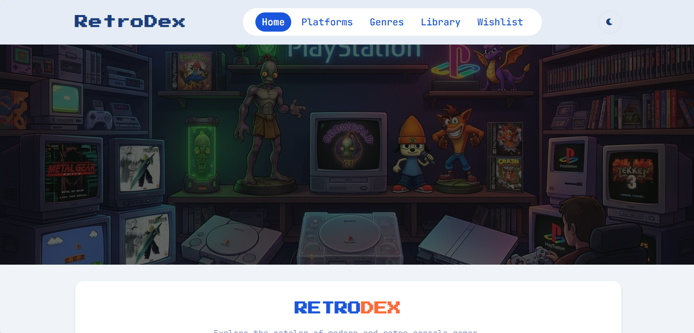

# RetroDex — Console Game Catalog

A Progressive Web App for discovering modern and retro console games, built with vanilla JavaScript as a single-page application with offline support.

 <!-- ganti/hapus kalau belum ada screenshot -->

## About

RetroDex is a catalog/discovery app for browsing games across every console generation — from retro systems like the SNES and Sega Genesis to modern platforms like the PS5 and Xbox Series X. It was built as a portfolio project to demonstrate front-end fundamentals without relying on a framework: a hand-built SPA router, a service layer for API communication, and a Service Worker for offline capability, all in vanilla JavaScript.

## Features

- **Live search with debounce** — instant game suggestions while typing, with a dedicated full results page on submit
- **Multi-filter browsing** — filter by console, genre, developer, and sort order (rating, release date, popularity, A-Z)
- **Numbered pagination** — navigate large result sets with smart page-range display (1 ... 4 5 6 ... 20)
- **Platform & Genre pages** — browse by console generation (PS1 through PS5, separately) or by genre
- **Wishlist & Library** — save games you want to play or already own, persisted in `localStorage`
- **Toast notifications** — instant feedback when adding/removing from Wishlist or Library
- **Dark/Light theme** — respects system preference, remembers your choice
- **Fully responsive** — mobile-first design from 320px up to desktop
- **Progressive Web App** — installable to home screen, works offline for previously visited pages via Service Worker caching

## Tech Stack

| Category      | Technology                                                    |
| ------------- | ------------------------------------------------------------- |
| Build tool    | Vite                                                          |
| Language      | Vanilla JavaScript (ES Modules)                               |
| Styling       | Vanilla CSS (custom properties / design tokens, no framework) |
| Data          | [RAWG Video Games Database API](https://rawg.io/apidocs)      |
| PWA           | vite-plugin-pwa (Workbox)                                     |
| Notifications | Notyf                                                         |
| Icons         | Font Awesome                                                  |

## Architecture Highlights

This project intentionally avoids a front-end framework to demonstrate the underlying concepts frameworks abstract away:

- **`router/router.js`** — a hash-based SPA router built from scratch, supporting dynamic path parameters (`/game/:slug`) and query strings (`/search?q=...&sort=...`)
- **`data/api.js`** — a service layer wrapping all RAWG API calls, with in-memory caching for rarely-changing data (platforms, genres, developers)
- **`data/collection.js`** — a generic localStorage-backed system powering both Wishlist and Library with a single implementation
- **`utils/gameResults.js`** — shared rendering logic reused across Search, Platform, and Genre pages to avoid duplication

## Getting Started

### Prerequisites

- Node.js (v18 or later recommended)
- A free RAWG API key — get one at [rawg.io/apidocs](https://rawg.io/apidocs)

### Installation

```bash
# Clone the repository
git clone https://github.com/your-username/retrodex-catalog-app.git
cd retrodex-catalog-app

# Install dependencies
npm install

# Set up your API key
cp .env.example .env
# then edit .env and add your RAWG API key
```

Your `.env` file should look like:

```
VITE_RAWG_API_KEY=your_api_key_here
```

### Development

```bash
npm run dev
```

Opens the app at `http://localhost:5173`.

### Production Build

```bash
npm run build
npm run preview
```

`npm run preview` is required to test PWA/offline functionality — the Service Worker does not activate in `npm run dev`.

## Project Structure

```
retrodex-catalog-app/
├── index.html
├── vite.config.js
├── public/
│   └── icons/              # PWA icons (192x192, 512x512)
├── src/
│   ├── scripts/
│   │   ├── main.js         # Entry point, route registration
│   │   ├── router/         # Hash-based SPA router
│   │   ├── data/           # API service layer + localStorage collections
│   │   ├── pages/          # One render function per route
│   │   ├── components/     # Reusable UI: navbar, footer, game card, etc.
│   │   └── utils/          # Shared helpers: debounce, pagination, toast, spinner
│   └── styles/
│       ├── variables.css   # Design tokens (colors, spacing, typography)
│       ├── base.css
│       ├── components.css
│       ├── layout.css
│       └── responsive.css
```

## Data Attribution

Game data and images are provided by [RAWG.io](https://rawg.io), used under their free API terms.

## Author

Built by Irfan Prasetyo as part of a front-end development portfolio while transitioning careers into web development.
